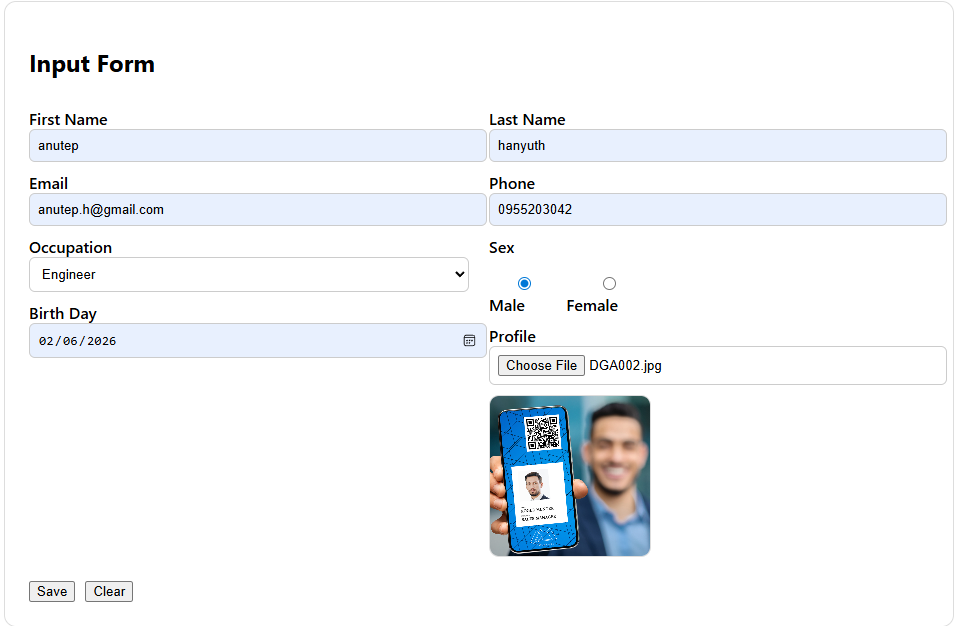

# 📌 InputForm Frontend

Angular frontend application for the **InputForm** system.  
This UI allows users to submit personal information along with a profile image, featuring real-time validation, image preview, and seamless API integration with the backend.

---

## 🧰 Tech Stack

- Angular (Standalone Components)
- Reactive Forms
- TypeScript
- RxJS
- REST API Integration

---

## ✨ Features

✅ Reactive form with validation  
✅ Image preview before upload  
✅ Multipart form submission  
✅ Success & error handling  
✅ Occupation dropdown from API  
✅ Clean two-column layout  
✅ Reset / Clear form  
✅ Production-ready structure  

---

## 🖼 UI Preview



---

## 🚀 Getting Started

### Clone Repository

```bash
git clone https://github.com/nuba55yo/inputform_frontend.git
cd inputform_frontend
```

---

### Install Dependencies

```bash
npm install
```

---

### Run Application

```bash
ng serve
```

Open:

```
http://localhost:4200
```

---

## 🔗 Backend Connection

Ensure the backend API is running before starting the frontend.

Example backend:

```
https://localhost:7133
```

### (Recommended) Use Angular Proxy

Create `proxy.conf.json`:

```json
{
  "/api": {
    "target": "https://localhost:7133",
    "secure": false,
    "changeOrigin": true,
    "logLevel": "debug"
  }
}
```

Run with proxy:

```bash
ng serve --proxy-config proxy.conf.json
```

---

## 📁 Project Structure

```
src/app
 ├── pages/
 │    └── inputform/
 │         ├── inputform.component.ts
 │         ├── inputform.component.html
 │         └── inputform.component.css
 │
 ├── services/
 │    └── inputform.service.ts
```

---

## 🔒 File Upload Rules

- Supported formats: **PNG, JPEG, WEBP**
- Maximum size: **1MB**

---

## ⚙️ Environment Configuration

Update API base URL if needed:

```
src/environments/environment.ts
```

Example:

```ts
export const environment = {
  production: false,
  apiBaseUrl: 'https://localhost:7133'
};
```

---

## 🧠 Architecture Note

This project uses **Angular Standalone Components**:

- No AppModule required  
- Better tree-shaking  
- Faster builds  
- Modern Angular architecture  

Recommended for new Angular applications.

---

## 👨‍💻 Author

Developed for the **InputForm** system frontend.
